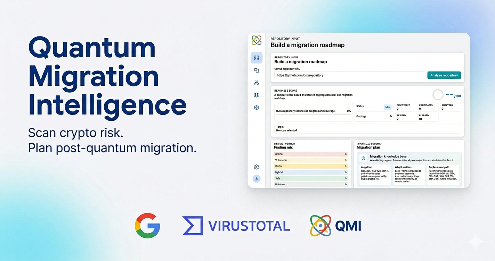

<p align="center">
  
</p>

<h1 align="center">Quantum Migration Intelligence</h1>

<p align="center">
  <strong>Cryptography Exposure to Migration Roadmap</strong>
</p>

<p align="center">
  
  
  
  
</p>

<p align="center">
  
</p>

## Overview

QMI is a repository-to-roadmap PoC for post-quantum migration planning. It scans a public GitHub repository, normalizes cryptographic findings, groups exposure by risk, and turns the result into a prioritized migration plan.

The goal is not to prove that a repository is crypto-free. The goal is to make cryptographic exposure visible enough for security and engineering teams to decide what to review first.

## Current Capabilities

- Analyze public GitHub repositories.
- Run QRAMM CryptoScan when available in the scanner container.
- Fall back to an internal repository pattern scanner for local development.
- Normalize findings into risk levels, file context, confidence, source tool, and line-level GitHub links.
- Show scan progress, elapsed time, cancellation, errors, repository metadata, and scan coverage.
- Filter risk exposure and findings from the dashboard.
- Generate a prioritized migration plan with guided remediation pages.
- Provide an internal algorithm documentation index with an ML-KEM page.

## PoC Scope

This project currently supports public repository scanning only.

During analysis, repositories are cloned temporarily inside the scanner container. Scan metadata, normalized findings, file locations, and migration recommendations may be stored in PostgreSQL.

Private repository access, authentication, AI-assisted code replacement, and complete algorithm documentation are intentionally out of scope for this PoC iteration.

## Local Setup

Create the environment file:

```sh
cp .env.example .env
```

Start the stack:

```sh
docker compose up --build
```

Open the app:

```text
http://localhost
```

Nginx serves the frontend and proxies API requests under `/api` to the backend.

## API

```text
POST /api/scans
GET  /api/scans
GET  /api/scans/:id
POST /api/scans/:id/cancel
GET  /api/scans/:id/findings
GET  /api/scans/:id/migration-plan
```

## Configuration

Key environment variables:

```text
DATABASE_URL
POSTGRES_DB
POSTGRES_USER
POSTGRES_PASSWORD
SCAN_MAX_FILES
SCAN_MAX_FILE_BYTES
CRYPTOSCAN_BIN
CRYPTOSCAN_TIMEOUT_MS
CRYPTOSCAN_DISABLE_FALLBACK
GITHUB_TOKEN
```

`GITHUB_TOKEN` is optional and server-side only. It can be used to raise public GitHub API rate limits or prepare future private repository support.
